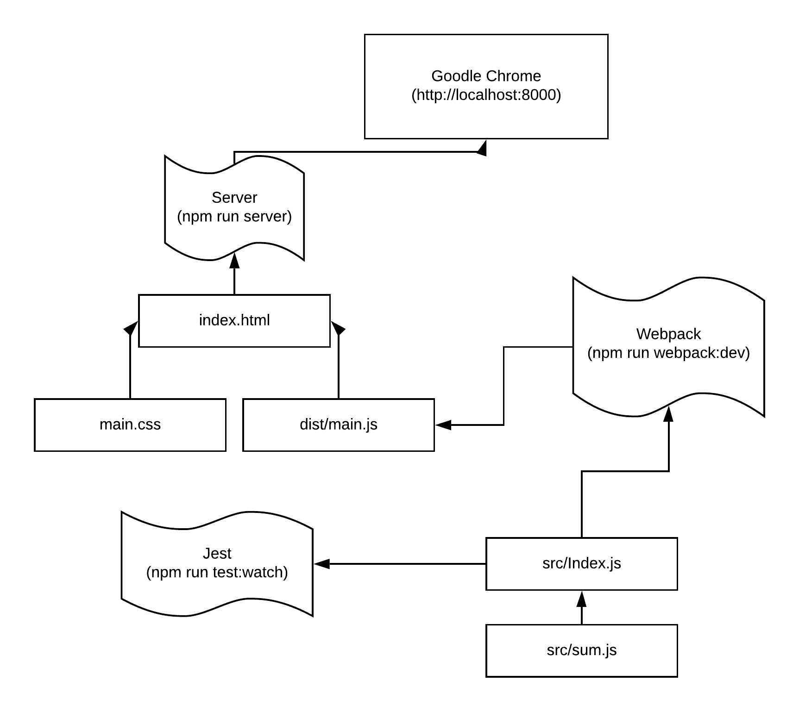

# Scoops Ahoy

## Simple Vanilla Boilerplate w/ Jest and Webpack

This boilerplate makes it easy to make testable front end code. It includes:

- `webpack`
- `jest`
- `simplehttpserver`

## Getting Started

- Fork/Clone this repo.
- `npm install`
- Open 3 terminals and run:
  - `npm run webpack:dev`
  - `npm run server`
  - `npm run jest:watch`

## Deploying to Prod

The `package.json` includes `npm run test` and `npm run webpack:prod`. These commands will help your project with the CI/CD steps we established for week 1.

- `npm run test` will run tests and exit instead of watching for file changes.
- `npm run webpack:prod` will build a production webpack build of your javascript files. If you have multiple files it'll package them all into one file (dist/main.js). This `dist` folder is gitignored but it should be pushed to the gh-pages branch. See [this guide](https://gist.github.com/cobyism/4730490).
